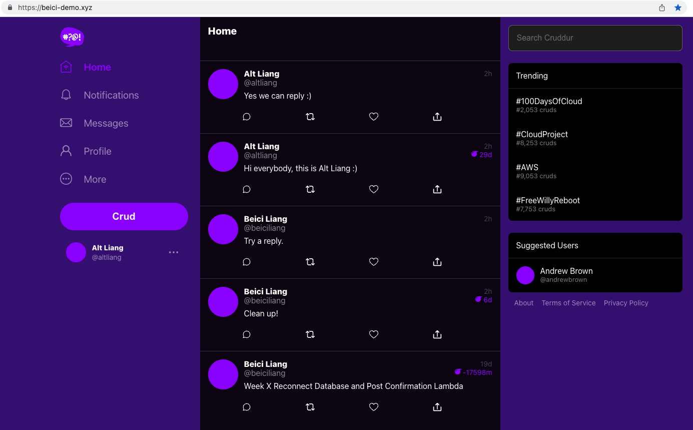

# AWS Cloud Project Bootcamp - Cruddur

- Codebase: this repo was created from [this template](https://github.com/ExamProCo/aws-bootcamp-cruddur-2023)
- Cohort: 2023-A1 ([bootcamp website](https://aws.cloudprojectbootcamp.com/))
- In the end, I obtained the AWS Cloud Project Bootcamp Certificate (Red Squad) with Demonstration of Exceptional Skills as a Cloud Engineer ([certificate at LinkedIn](https://www.linkedin.com/posts/beiciliang_aws-cloud-project-bootcamp-certificate-red-activity-7103294105505427457-TrRE?utm_source=share&utm_medium=member_desktop))!

## Journaling Homework

The `/journal` directory contains:

- [x] [Week 0 - Billing and Architecture](journal/week0.md)
- [x] [Week 1 - App Containerization](journal/week1.md)
- [x] [Week 2 - Distributed Tracing](journal/week2.md)
- [x] [Week 3 - Decentralized Authentication](journal/week3.md)
- [x] [Week 4 - Postgres and RDS](journal/week4.md)
- [x] [Week 5 - DynamoDB and Serverless Caching](journal/week5.md)
- [x] [Week 6 - Deploying Containers](journal/week6.md)
- [x] [Week 7 - Solving CORS with a Load Balancer and Custom Domain](journal/week7.md)
- [x] [Week 8 - Serverless Image Processing](journal/week8.md)
- [x] [Week 9 - CI/CD with CodePipeline, CodeBuild and CodeDeploy](journal/week9.md)
- [x] [Week 10 - CloudFormation](journal/week10.md)

Note:

- Week for clean up is also described in [Week 10 - CloudFormation](journal/week10.md).
- My demo can be seen on ~~https://beici-demo.xyz/~~ (sorry domain expired, not available anymore), which just serves as a static website. This is because the task of Fargate services has been set to 0 in order to save my AWS budget.

## Instructions

Follow [this playlist](https://www.youtube.com/playlist?list=PLBfufR7vyJJ7k25byhRXJldB5AiwgNnWv) to watch detailed instructions by Andrew Brown, who organized this bootcamp with other guest instructors.

In the end of this bootcamp, the Cruddur application looks like follows:

A user can:

- Sign up and sign in to post and reply a crud;
- Send messages to others;
- Edit bio and upload avatar.
