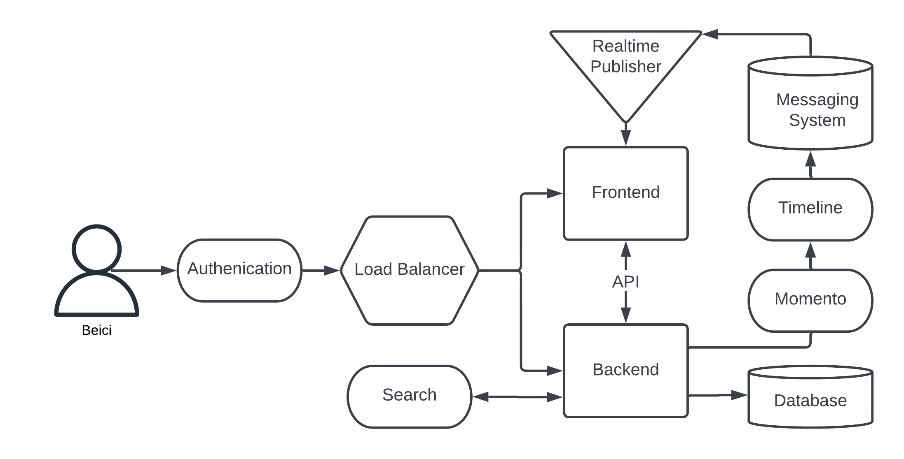
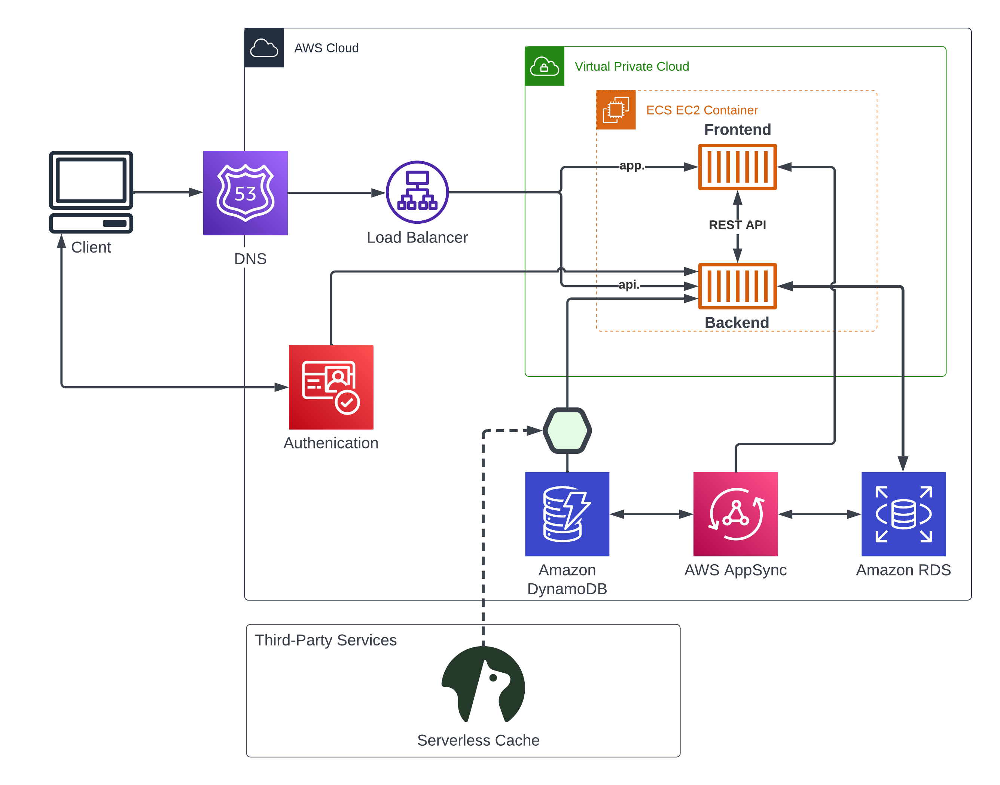

# Week 0 — Billing and Architecture

Table of Contents

- [AWS Setup & Use CloudShell](#aws-setup--use-cloudshell)
- [Gitpod Workspace](#gitpod-workspace)
- [Alert Setup](#alert-setup)
- [Recreation in Lucid Charts](#recreation-in-lucid-charts)

## AWS Setup & Use CloudShell

Sign in as the root user, and do the following setups in the console
- IAM Security: assign MFA to improve security for this account.
- IAM Users: create a new user `beiciliang` with `AdministratorAccess` (added to the `Admin` user group).
- IAM Dashboard: create account alias as `beiciliang-aws-bootcamp`.

Log out the root user, and sign in as the newly created IAM user to
- IAM Security: since this user has `AdministratorAccess`, it's better to assign MFA to improve security for this account.
- IAM Users: create access key in security credentials using CLI.

Launch AWS CloudShell in the browser: run `aws --cli-auto-prompt` and then do a sanity check by `aws sts get-caller-identity`. It's shown that `UserId`, `Account` and `Arn` match the user info as presented in the figure below.

## Gitpod Workspace

1. Install AWS CLI

Gitpod the Github repo, a browser of VS Code will pop up. In the terminal, install AWS CLI following [this guide](https://docs.aws.amazon.com/cli/latest/userguide/getting-started-install.html). Then we can run AWS commands in the current Gitpod workspace.

To make the above configurations automatically loaded when a Gitpod workspace launches, modify the `.gitpod.yml`, and in a new branch `git checkout -b week-0`, commit and push the changes ([click here](https://github.com/beiciliang/aws-bootcamp-cruddur-2023/blob/week-0/.gitpod.yml) to see the updated `.gitpod.yml`).

2. Verification

To run AWS commands as the newly created IAM user, environment variables need to be configured according to the user's credentials. It can be done by `export` or `gb env` commands, or by configuring the persistent environment variables in Gitpod's account settings as shown in the figure below.

Now if we Gitpod the `week-0` branch and run `aws sts get-caller-identity`, it returns correct info as shown in the figure below

## Alert Setup

Alerts can be created using the AWS console, or AWS CLI.

1. Create a Billing Alarm

The figure below proofs that an alarm named `Billing Alert` was created. It will be triggered when services charge more than 10 USD.

2. Create a Budget

The figure below proofs that a budget was created from the template. It set the monthly budget is 10 USD.

## Recreation in Lucid Charts

1. Conceptual Diagram

It's plotted in [this Lucid Chart link](https://lucid.app/lucidchart/be8a8049-f889-46c4-83b9-cd52f06a9445/edit?viewport_loc=13%2C-90%2C1722%2C815%2Cvi_xnvX6lTaw&invitationId=inv_9600c9fb-e606-403a-888a-9fe299d682da). Screenshot of the conceptual diagram is attached below.

2. Logical Architectural Diagram

It's plotted in [this Lucid Chart link](https://lucid.app/lucidchart/be8a8049-f889-46c4-83b9-cd52f06a9445/edit?viewport_loc=-311%2C177%2C2037%2C964%2C0_0&invitationId=inv_9600c9fb-e606-403a-888a-9fe299d682da). Screenshot of the logical architectural diagram is attached below.

