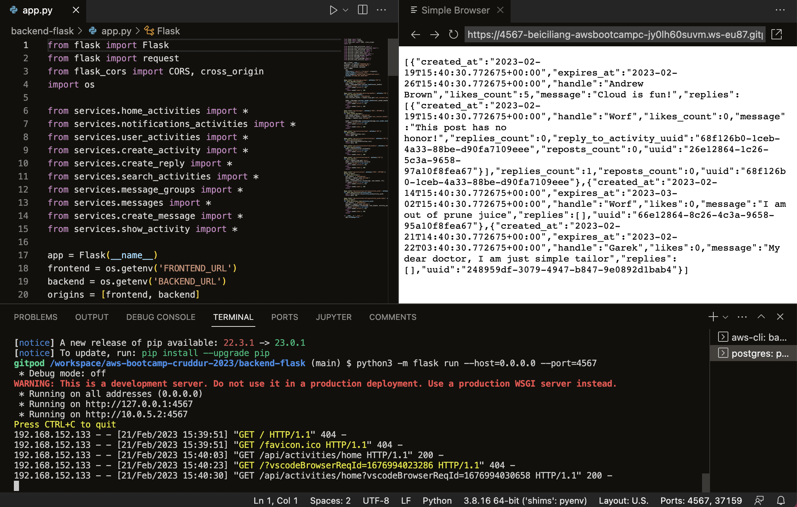
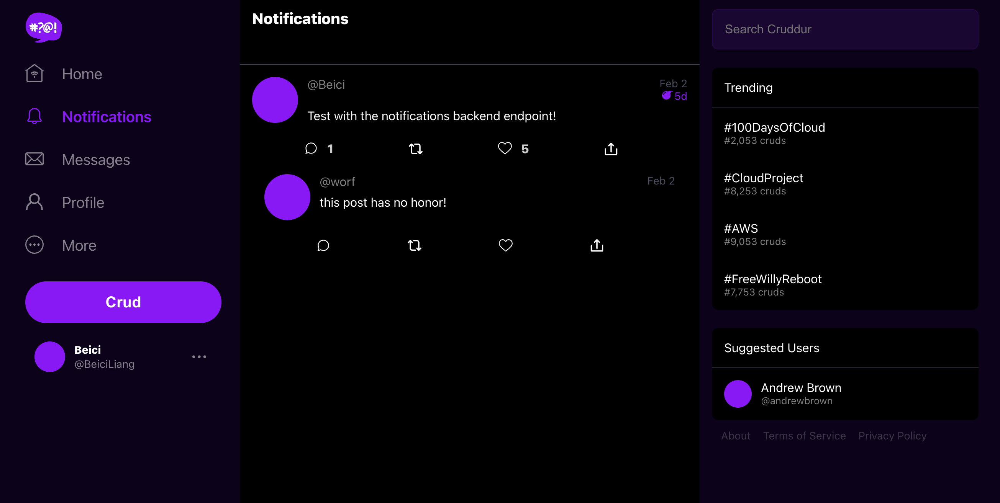
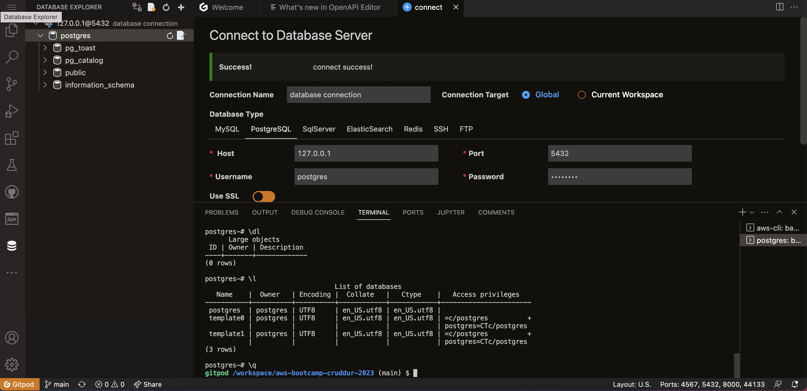

# Week 1 — App Containerization

Based on what I've done in [week0](https://github.com/beiciliang/aws-bootcamp-cruddur-2023/blob/main/journal/week0.md), gitpod the branch of [week-0](https://github.com/beiciliang/aws-bootcamp-cruddur-2023/tree/week-0) and do the following steps (commit to the branch of [week-1](https://github.com/beiciliang/aws-bootcamp-cruddur-2023/tree/week-1) and merge to the main branch):

- [Get the apps running locally](#get-the-apps-running-locally)
- [Containerize backend and frontend](#containerize-backend-and-frontend)
- [Add notification endpoint and React page](#add-notification-endpoint-and-react-page)
- [Compose multiple containers with DynamoDB Local and Postgres](#compose-multiple-containers-with-dynamodb-local-and-postgres)
- [Homework challenges](#homework-challenges)
- [References](#references)

## Get the apps running locally

For the backend, run the following commands to install and run flask via port `4567`.

```sh
cd /workspace/aws-bootcamp-cruddur-2023/backend-flask
pip3 install -r requirements.txt
export FRONTEND_URL="*"
export BACKEND_URL="*"
python3 -m flask run --host=0.0.0.0 --port=4567
```

Then make sure to unlock `4567` on the port tab, open the corresponding link in the browser, and append `/api/activities/home` to the url. A json response will be returned as shown in the screenshot below.



For the frontend, install npm. This is needed before building the docker container since it needs to copy the contents of node_modules.

```
cd /workspace/aws-bootcamp-cruddur-2023/frontend-react-js
npm i
```

## Containerize backend and frontend

For the backend, create a Dockerfile as `backend-flask/Dockerfile` ([code](https://github.com/beiciliang/aws-bootcamp-cruddur-2023/blob/week-1/backend-flask/Dockerfile)). Then build and run the container:

```sh
cd /workspace/aws-bootcamp-cruddur-2023
docker build -t  backend-flask ./backend-flask
docker run --rm -p 4567:4567 -it -e FRONTEND_URL='*' -e BACKEND_URL='*' backend-flask
```

We can send curl to test the server, which returns json as the response in the previous section:

```sh
curl -X GET http://localhost:4567/api/activities/home -H "Accept: application/json" -H "Content-Type: application/json"
```

For the frontend, create a Dockerfile as `frontend-react-js/Dockerfile` ([code](https://github.com/beiciliang/aws-bootcamp-cruddur-2023/blob/week-1/frontend-react-js/Dockerfile)). Then build and run the container: 

```sh
cd /workspace/aws-bootcamp-cruddur-2023
docker build -t frontend-react-js ./frontend-react-js
docker run --rm -p 3000:3000 -d frontend-react-js
```

A preview of the frontend can be seen in gitpod with the unlocked port of `3000`.

## Add notification endpoint and React page

For the backend, as seen in [this commit](https://github.com/beiciliang/aws-bootcamp-cruddur-2023/commit/034ccaf99bd95eee2d69014046d373fab5d12590), modify the following files:
- `backend-flask/openapi-3.0.yml`: add `/api/activities/notifications` in `paths` (take ` /api/activities/home` as reference)
- `backend-flask/app.py`: add the route for `/api/activities/notifications` and define the function for `data_notifications`, which uses the class `NotificationsActivities` imported from `services.notifications_activities`
- `backend-flask/services/notifications_activities.py`: define the class `NotificationsActivities` (take `home_activities.py` as reference)

For the frontend, as seen in [this commit](https://github.com/beiciliang/aws-bootcamp-cruddur-2023/commit/8d7912cfef3a507e19bad39b518d3db406f511c6), modify the following files:
- `frontend-react-js/src/App.js`: add path and element for notifications in the router
- `frontend-react-js/src/pages/NotificationsFeedPage.js`: create js file for the notification page (take `HomeFeedPage.js` as reference)
- `frontend-react-js/src/pages/NotificationsFeedPage.css`: create an empty css file

## Compose multiple containers with DynamoDB Local and Postgres

Create `docker-compose.yml` at the root of the project ([code](https://github.com/beiciliang/aws-bootcamp-cruddur-2023/blob/week-1/docker-compose.yml)). We are going to use Postgres and DynamoDB local in future labs. We can bring them in as containers and reference them externally.

Now run `docker compose up` and unlock the ports (`3000`, `4567`, `5432`). Now open the link of `3000` in the browser, sign up and sign in as a new user (verified with the code of `1234` saved in the cookies). Now in the "Notifications", the application is shown as the screenshot below.



In gitpod's database explore, connect to the PostgreSQL. Run command `psql -U postgres -h localhost`, then you can explore the database as shown in the screenshot below.



## Homework challenges

1. Run the dockerfile CMD as an external script

As seen in [Get the apps running locally](#get-the-apps-running-locally), we can run the flask backend as command lines corresponding to the CMD in [backend-flask/Dockerfile](https://github.com/beiciliang/aws-bootcamp-cruddur-2023/blob/week-1/backend-flask/Dockerfile).

2. Push and tag a image to DockerHub (they have a free tier)

Using the following commands, I firstly login, then tag and push the image of backend created from the previous step to my public repo at DockerHub named [beiciliang/aws-bootcamp-cruddur-2023](https://hub.docker.com/r/beiciliang/aws-bootcamp-cruddur-2023).

```
docker login -u beiciliang
docker tag aws-bootcamp-cruddur-2023-backend-flask:latest beiciliang/aws-bootcamp-cruddur-2023:backend-flask-week1
docker push beiciliang/aws-bootcamp-cruddur-2023:backend-flask-week1
```

After the image is successfully pushed, you can see it's listed at [the tag page](https://hub.docker.com/r/beiciliang/aws-bootcamp-cruddur-2023/tags).

## References

- Good Article for Debugging Connection Refused ([link](https://pythonspeed.com/articles/docker-connection-refused/))
- VSCode Docker Extension ([link](https://code.visualstudio.com/docs/containers/overview))
- Example of using DynamoDB local ([link](https://github.com/100DaysOfCloud/challenge-dynamodb-local))
