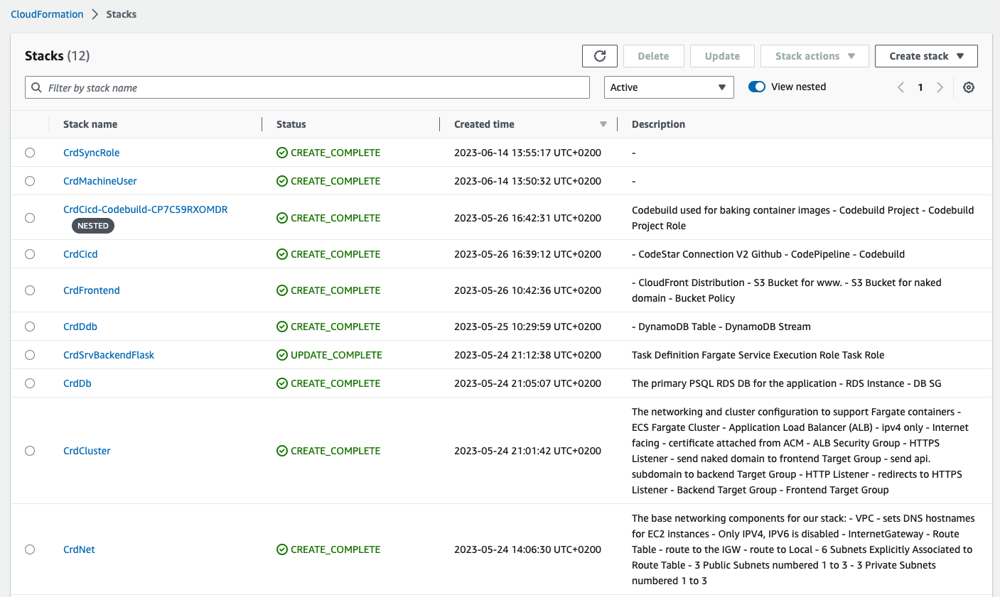
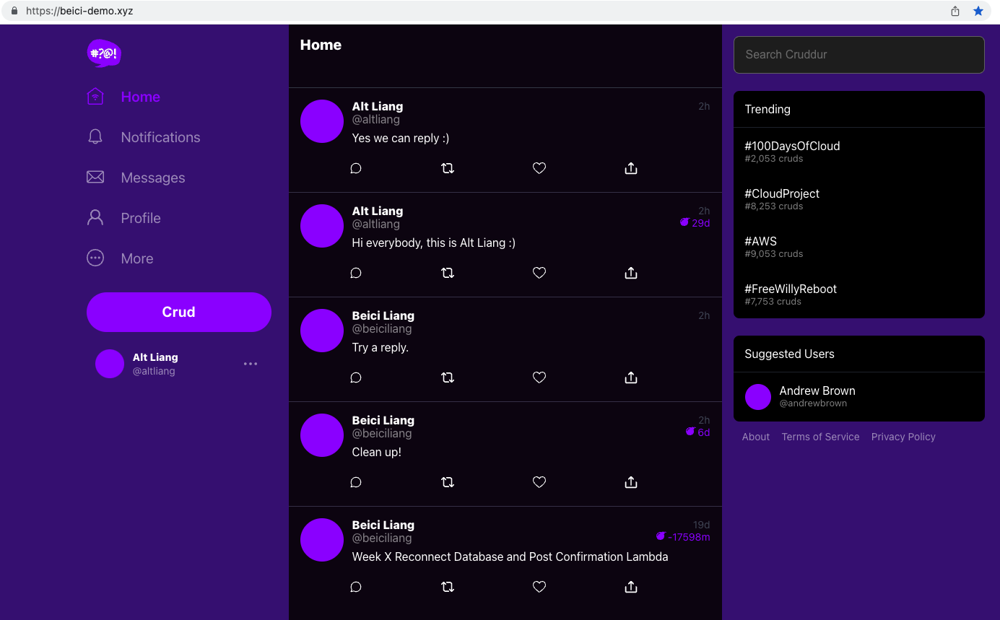

# Week 10 — CloudFormation and Clean Up

Based on what I've done in previous [week9](https://github.com/beiciliang/aws-bootcamp-cruddur-2023/blob/main/journal/week9.md), open a new gitpod workspace and do the following steps (in the end, changes are committed to the branch of [week-10](https://github.com/beiciliang/aws-bootcamp-cruddur-2023/tree/week-10) and then merged to the main branch):

- [Preparation](#preparation)
- [Template and Config](#template-and-config)
- [Command](#command)
- [Static Website Hosting for Frontend](#static-website-hosting-for-frontend)
- [Settings for DB](#settings-for-db)
- [Clean Up](#clean-up)

## Preparation

Update `gitpod.yml` to install cfn-lint, cfn-guard, cfn-toml, etc.

Create two S3 buckets `cfn-artifacts-beici` and `codepipeline-cruddur-artifacts-beici` by:

```
aws s3 mb s3://cfn-artifacts-beici
export CFN_BUCKET="cfn-artifacts-beici"
gp env CFN_BUCKET="cfn-artifacts-beici"

aws s3 mb s3://codepipeline-cruddur-artifacts-beici
```

## Template and Config

Create a new folder `aws/cfn` to save template and config (change to your own parameters) for each CloudFormation stack, including:

- Base networking components: `networking/template.yaml` and `networking/config.toml`
- Networking and cluster configuration to support Fargate containers: `cluster/template.yaml` (change to your own namespace) and `cluster/config.toml`
- RDS database for the application: `db/template.yaml` and `db/config.toml`
- Fargate backend service: `service/template.yaml` (change to your own namespace, role and policy names) and `service/config.toml`
- CICD for the backend servie: `cicd/nested/codebuild.yaml`, `cicd/template.yaml`, `cicd/config.toml`
- Frontend: `frontend/template.yaml` and `frontend/config.toml`
- Sync changes for the frontend: `sync/template.yaml` and `sync/config.toml`
- Dedicated user role for CFN: `machine-user/template.yaml` and `machine-user/config.toml`

## Command

Create and run command scripts for the above CFN, then we can execute the change set and check the output on AWS CloudFormation.

- Run `./bin/cfn/networking` to create `CrdNet` stack.
- Run `./bin/cfn/cluster` to create `CrdCluster` stack.
- Edit Route53 type A records for `api.beici-demo.xyz` to point to the `CrdClusterALB`.
- Export `DB_PASSWORD` and run `./bin/cfn/db` to create `CrdDb` stack.
- It will take some time to create the RDS database `cruddur-instance`. When it's done, get its endpoint, and update the `CONNECTION_URL` in AWS System Manager's Parameter Store.
- Run `./bin/cfn/service` to create `CrdSrvBackendFlask` stack.
- Use SAM to run `./ddb/build` (to create `.aws-sam`), then `./ddb/package`, and finally `./ddb/deploy`, in order to create `CrdDdb` stack.
- Use the created DDB table from above step as the value for `DDBMessageTable` to update `aws/cfn/service/template.yaml` and `aws/cfn/service/config.toml`, then run again `./bin/cfn/service`.
- Run `./bin/cfn/frontend` to create `CrdFrontend` stack. At this stage, no frontend code is deployed to it, so we need to setup static building and syncing in the following sections.
- Edit Route53 type A records for `beici-demo.xyz` and `www.beici-demo.xyz` to point to the CloudFront created by `CrdFrontend`.
- Delete the old AWS codepipeline and codebuild and run `./bin/cfn/cicd` to create `CrdCicd` stack and a nested one.
- Run `./bin/cfn/machineuser` to create `CrdMachineUser` stack. In IAM > Users > cruddur_machine_user > create access key, then update the generated key in Parameter Store.

To successfully pass the health check in the backend service, worth checking the following settings:

- Parameter Store set to correct `CONNECTION_URL`, `AWD_ACCESS_KEY_ID` and `AWS_SECRET_ACCESS_KEY`.
- RDS database created by `CrdDb` is running.
- Security group `CrdDbRDSSG` has a inbound rule that sets to port 5432 and sources `CrdClusterServSG`.
- Security group `CrdClusterServSG` has a inbound rule that sets to port 4567 and source `CrdClusterALBSG`.
- Security group `CrdClusterALBSG` has inbound rules to allow all HTTP and HTTPS traffics.
- Edit health check settings for the target group of `CrdClu-Backe-XXX`, in advanced settings, set the health check port to override port 4567.
- Make sure Route53's type A records are using the correct routes.

Now if we merge this week-10 branch to the prod branch, it will trigger CICD. In AWS, Developer Tools > Connections > CrdCicd-connection, update pending connection. If successful, `https://api.beici-demo.xyz/api/health-check` will return `{"success":true,"ver":1}`. A screenshot of succeeded pipeline is attached below.


## Static Website Hosting for Frontend

We use a Ruby-based tool to sync a folder from local development to S3 bucket, and then invalidate the CloudFront cache.

Create the following scripts:

- `./bin/frontend/static-build` and `./bin/frontend/sync`
- `./erb/sync.env.erb` (change to your own `SYNC_S3_BUCKET` and `SYNC_CLOUDFRONT_DISTRIBUTION_ID`)
- `./tmp/.keep` as a placeholder
- `Gemfile`
- `Rakefile`
- `./bin/cfn/sync`

Also update `./bin/frontend/generate-env` and frontend components as mainly seen in [this commit](https://github.com/beiciliang/aws-bootcamp-cruddur-2023/commit/1fc9628911ac57adf6335d8c365dcc79142ea0af).

Now we initialize the static hosting by uploading the frontend to S3 bucket:

- run `./bin/frontend/static-build`
- `cd frontend-react-js` then `zip -r build.zip build/`
- download and decompress the zip, and upload everything inside the build folder to s3://beici-demo.xyz

For syncing:

- Install by `gem install aws_s3_website_sync dotenv`
- Run `./bin/frontend/generate-env` to generate `sync.env`
- Run `./bin/frontend/sync` to sync
- Run `./bin/cfn/sync` to create stack `CrdSyncRole`, add the permissions by creating an inline policy `S3AccessForSync` for the created `CrdSyncRole` with S3 service, actions of GetObject, PutObject, ListBucket and DeleteObject, resources specific to bucket `beici-demo.xyz`, and resource with the same bucket and any object.

Later if frontend is changed, we can sync by running `./bin/frontend/static-build` and then `./bin/frontend/sync`.

## Settings for DB

In order to do some DB migration from gitpod, we firstly need to edit inbound rules for `CrdDbRDSSG` to allow gitpod IP. Then update the following env according to our CFN:

```sh
export GITPOD_IP=$(curl ifconfig.me)
export DB_SG_ID="your_security_group_id_of_CrdDbRDSSG"
gp env DB_SG_ID="your_security_group_id_of_CrdDbRDSSG"
export DB_SG_RULE_ID="corresponding_sgr_for_gitpod"
gp env DB_SG_RULE_ID="corresponding_sgr_for_gitpod"
export PROD_CONNECTION_URL='postgresql://cruddurroot:<your_password>@<endpoint_of_cruddur-instance>:5432/cruddur'
gp env PROD_CONNECTION_URL='postgresql://cruddurroot:<your_password>@<endpoint_of_cruddur-instance>:5432/cruddur'

./bin/rds/update-sg-rule
./bin/db/schema-load prod
```

Since we need to add other columns to the RDS DB, run `./bin/generate/migration reply_to_activity_uuid_to_string` to generate `backend-flask/db/migrations/xxxxx_reply_to_activity_uuid_to_string.py`, edit this python file and then run `CONNECTION_URL=$PROD_CONNECTION_URL ./bin/db/migrate`. Column `bio` will be added to the `users` table, and `reply_to_activity_uuid` added to the `activities` table.

Plus, in `cruddur-post-confirmation` Lambda, change `CONNECTION_URL`, VPC (change to the ones created by CFN, create a new `CognitoLambdaSG` with the `CrdNet` VPC), edit inbound rules of `CrdDbRDSSG` to allow `CognitoLambdaSG`.

## Clean Up

Up to this point, we have created CloudFormation stacks as seen in the screenshot below.



As mainly seen in [this commit](https://github.com/beiciliang/aws-bootcamp-cruddur-2023/commit/4af71269ba106663dcbd43d9ddd984e9e0e7bd20), clean up backend and frontend to:

- refactor to use JWT Decorator, app.py, and routes
- implement replies for posts
- improve error handling

Since the backend is updated, we can trigger CICD by merging this branch to the prod branch. Since the frontend is also updated, we can sync by running `./bin/frontend/static-build` and then `./bin/frontend/sync`.

Following screenshots present https://beici-demo.xyz/ is working:

1. Existing user `@beiciliang` can do crud `Clean up!` in the homepage, and reply to this crud with message `Try a reply.`.

2. Signup a new user `@altliang` who can also crud `Hi everybody, this is Alt Liang :)`, and reply to `@beiciliang`'s crud with message `Yes we can reply :)`.

3. User `@altliang` can send `@beiciliang` a direct message `Hey this is Alt Liang!` using url `https://beici-demo.xyz/messages/new/beiciliang`.


Now the homepage looks like follows:



Here are some other changes to make profile editing work in production:

- In `bin/frontend/static-build`, add env variable `REACT_APP_API_GATEWAY_ENDPOINT_URL` in order to be stored in production.
- In `backend-flask/routes/users.py`, route for `/api/profile/update` include method of `PUT`.
- In S3 bucket saving the uploaded avatars (in my case `beici-cruddur-uploaded-avatars`), edit the CORS configuration, including setting `AllowedOrigins` as your cruddur domain and `AllowedMethods` as `POST,PUT`.
- In Lambda `CruddurAvatarUpload`, edit `function.rb` by setting `Access-Control-Allow-Origin` as your cruddur domain and `Access-Control-Allow-Methods` as `OPTIONS,GET,POST,PUT`.

After editing the bio and uploading an avatar, my profile page looks like follows:


