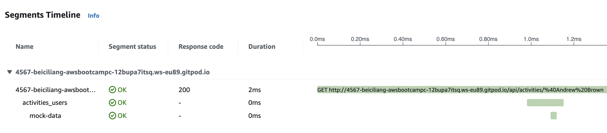
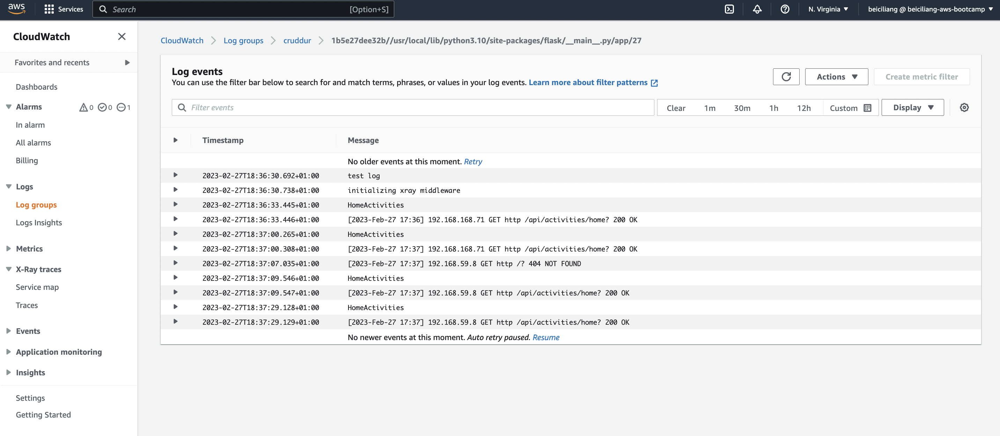

# Week 2 — Distributed Tracing

Based on what I've done in [week1](https://github.com/beiciliang/aws-bootcamp-cruddur-2023/blob/main/journal/week1.md), gitpod the branch of [week-1](https://github.com/beiciliang/aws-bootcamp-cruddur-2023/tree/week-1) and do the following steps (in the end, changes are committed to the branch of [week-2](https://github.com/beiciliang/aws-bootcamp-cruddur-2023/tree/week-2) and then merged to the main branch):

- [OTEL with Honeycomb](#otel-with-honeycomb)
- [AWS X-Ray](#aws-x-ray)
- [AWS CloudWatch Log](#aws-cloudwatch-log)
- [Rollbar for Error Logging](#rollbar-for-error-logging)
- [References](#references)

## OTEL with Honeycomb

On [Honeycomb website](https://www.honeycomb.io/), create a new environment named `bootcamp`, and get the corresponding API key. Mark the API key by commands:

```sh
gp env HONEYCOMB_API_KEY=<api_key_of_bootcamp>
export HONEYCOMB_API_KEY=<api_key_of_bootcamp>
```

Following Honeycomb's installation instructions, make the following changes as shown in [this commit](https://github.com/beiciliang/aws-bootcamp-cruddur-2023/commit/92ad0998d016bf2d0926d080768e320332b4cb2e)
- Add open telemetry related dependencies in `backend-flask/requirements.txt`, and pip install them
- Instrument honeycomb in `backend-flask/app.py`
- Add environment variables in `docker-compose.yml`

Then we can add spans and attributes to tracers as shown in [this commit](https://github.com/beiciliang/aws-bootcamp-cruddur-2023/commit/ef662fb1fc14fed7afbb79718702c9845cd5c5a5): add a span named `mock-data` with an attribute named `app.now` in the tracer named `home.activities` in `backend-flask/services/home_activities.py`. 

After `docker compose up` to launch the app and browse the backend endpoint of `/api/activities/home`, traces can be viewed on the Honeycomb website as shown in the screenshot below.


We can run queries to explore traces within Honeycomb as shown in the screenshot below.


## AWS X-Ray

To instrument AWS X-Ray into backend flask application, make the following changes as shown in [this commit](https://github.com/beiciliang/aws-bootcamp-cruddur-2023/commit/f47db0187eb421f08118bff314a35849baf935fb):
- Add `aws-xray-sdk` to `/backend-flask/requirements.txt`, and pip install it
- Instrument AWS X-Ray in `/backend-flask/app.py`
- Add `xray-daemon` and configure environment variables in `docker-compose.yml`

Then we can add segments and subsegments in `backend-flask/services/user_activities.py` for example as shown in [this commit](https://github.com/beiciliang/aws-bootcamp-cruddur-2023/commit/fabb76a787b233153a6e50a33af502e43e2727c0). These data can be sent data back to the X-Ray API.

After docker compose up, we can browse the home and a user page where we've add xray recorder to capture. Then we can observe X-Ray traces within the AWS Console as shown in the screenshot below.



We can setup AWS X-Ray resources in `aws/json/xray.json` as seen in [this commit](https://github.com/beiciliang/aws-bootcamp-cruddur-2023/commit/0fbb8e89bb3fc810e58f1d3e5fe7699a12da6af2), then run the following command lines to create tracing groups and sampling rules:

```sh
aws xray create-group --group-name "Cruddur" --filter-expression "service(\"backend-flask\")" 
aws xray create-sampling-rule --cli-input-json file://aws/json/xray.json
```

In AWS CloudWatch > Settings > X-Ray Traces, the created groups and sampling rules are shown as the screenshot below.


## AWS CloudWatch Log 

As seen in [this commit](https://github.com/beiciliang/aws-bootcamp-cruddur-2023/commit/a5a476e9d1c435572de4a66a9104c8ae609a7e7d), changes are made to install WatchTower and write a custom logger to send app log data to the AWS CloudWatch Log group named `cruddur`.
- Add `watchtower` to `/backend-flask/requirements.txt`, and pip install it
- Configuring Logger to use CloudWatch in `/backend-flask/app.py`
- Log info "HomeActivities" in `backend-flask/services/home_activities.py`
- Add AWS related environment variables in `docker-compose.yml`

After `docker compose up` to launch the app and browse the backend endpoint of `/api/activities/home` for a couple of times, logs can be viewed in AWS CloudWatch Log group of `cruddur` as shown in the screenshot below.



Then we comment codes related to CloudWatch Logger in order to save our AWS budgets.

## Rollbar for Error Logging

On [Rollbar website](https://rollbar.com/), select `Flask` for project initialization. Mark the project access token by commands:

```sh
export ROLLBAR_ACCESS_TOKEN=<access_token_of_project>
gp env ROLLBAR_ACCESS_TOKEN=<access_token_of_project>
```

Following the instructions in [this guideline](https://github.com/omenking/aws-bootcamp-cruddur-2023/blob/week-2/journal/week2.md#rollbar), make the following changes as shown in [this commit](https://github.com/beiciliang/aws-bootcamp-cruddur-2023/commit/126dab380a1e29c89d100089e87bb7a2dc4e2498)
- Add `blinker` and `rollbar` in `backend-flask/requirements.txt`, and pip install them
- Add an endpoint just for testing rollbar in `backend-flask/app.py`
- Add environment variables in `docker-compose.yml`

After `docker compose up` to launch the app and browse the backend endpoint, on the Rollbar website, click Items for FirstProject and select all the Levels, "HelleWorld" message for testing can be seen as the screenshot below.


We can further trigger an error and then observe this error with Rollbar.

## References

- AWS Developer Guide for AWS X-Ray daemon ([link](https://docs.aws.amazon.com/xray/latest/devguide/xray-daemon.html))
- How to add custom X-Ray Segments for Containerised Flask Application ([link](https://olley.hashnode.dev/aws-free-cloud-bootcamp-instrumenting-aws-x-ray-subsegments))
- Rollbar Flask Example ([link](https://github.com/rollbar/rollbar-flask-example/blob/master/hello.py))
