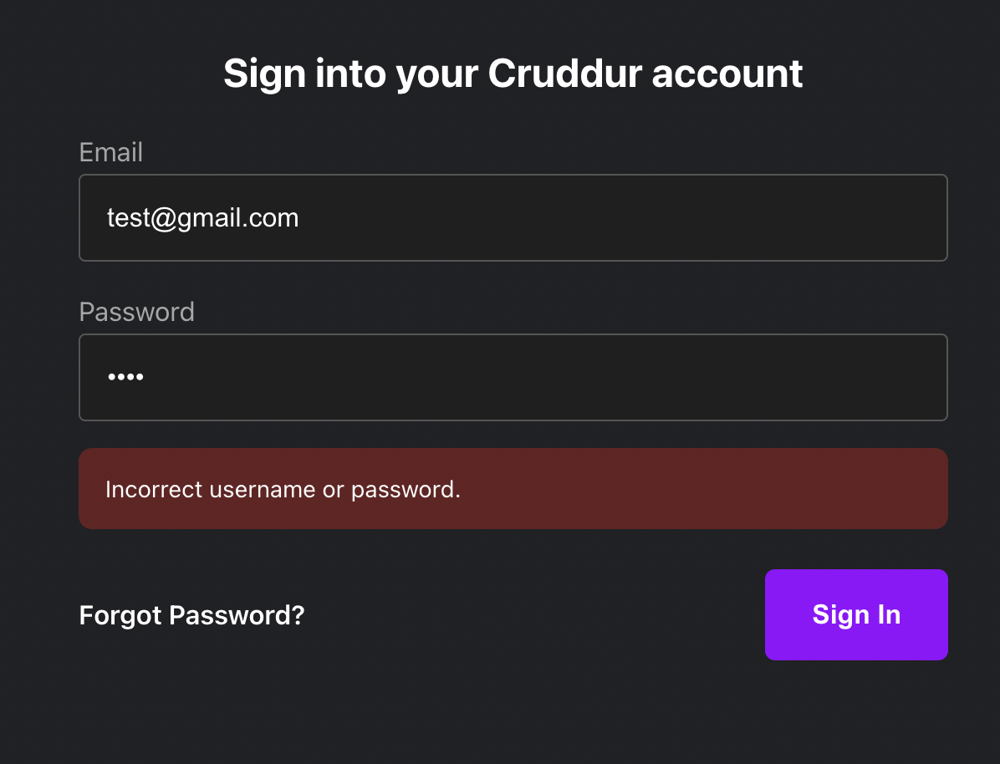
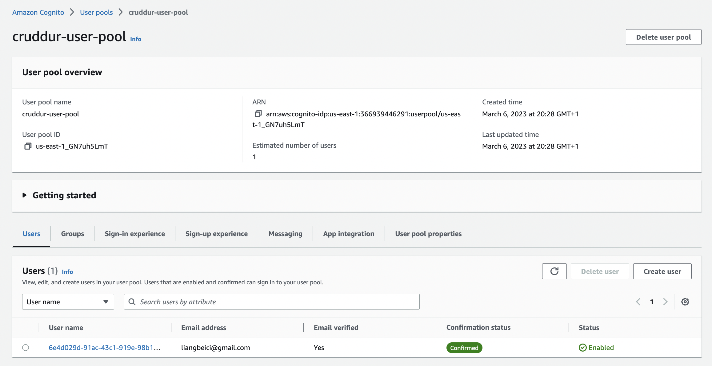
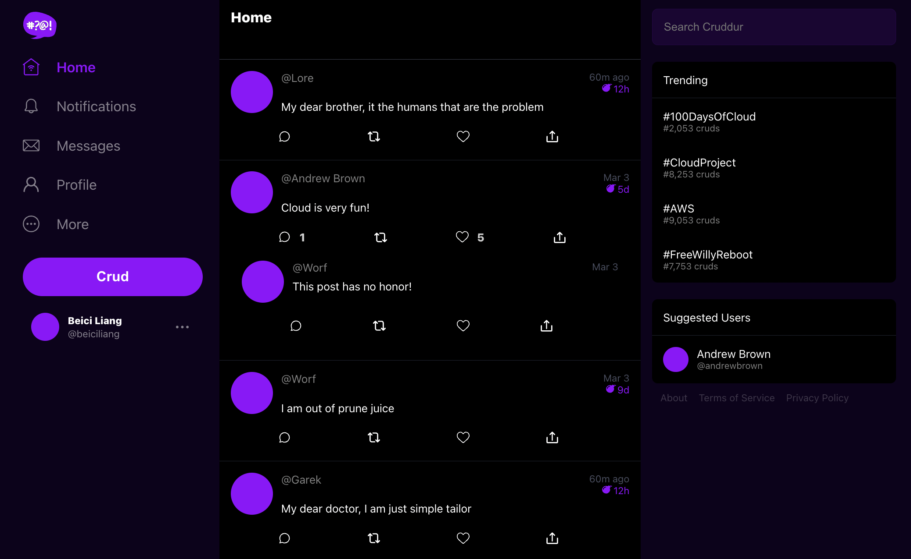
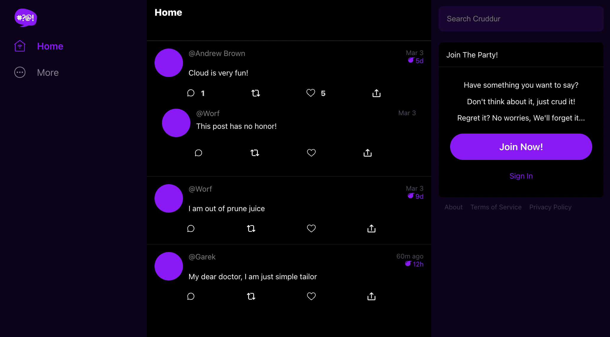

# Week 3 — Decentralized Authentication

Based on what I've done in [week2](https://github.com/beiciliang/aws-bootcamp-cruddur-2023/blob/main/journal/week2.md), gitpod the branch of [week-2](https://github.com/beiciliang/aws-bootcamp-cruddur-2023/tree/week-2) and do the following steps (in the end, changes are committed to the branch of [week-3](https://github.com/beiciliang/aws-bootcamp-cruddur-2023/tree/week-3) and then merged to the main branch):

- [Amazon Cognito User Pool](#amazon-cognito-user-pool)
- [Install and Configure Amplify](#install-and-configure-amplify)
- [JWT Server Side Verify](#jwt-server-side-verify)
- [Proof of Decentralized Authentication](#proof-of-decentralized-authentication)

## Amazon Cognito User Pool

On the AWS console for Cognito, create a new user pool with the following configurations:

- Configure sign-in experience with email selected only;
- Configure security requirements with no MFA;
- Configure sign-up experience with `name` and `preferred_username` as additional required attributes;
- Configure message delivery by email instead of SES;
- Integrate app with user pool name `cruddur-user-pool` and app client name `cruddur`.

Then we can retrieve the user pool id and app client id.

## Install and Configure Amplify

1. Install and configure Amplify client-side library for Amazon Cognito

Install Amplify by running command `npm i aws-amplify --save` in the `frontend-react-js` path. `package.json` and `package-lock.json` will be changed accordingly with the Amplify package.

As shown in [this commit](https://github.com/beiciliang/aws-bootcamp-cruddur-2023/commit/7262f9653327b68d4a3088a9ca8c6272a26d1df4), configure Amplify in `frontend-react-js/src/App.js` and add environment variables in `docker-compose.yml`.

2. Implement API calls to Amazon Coginto for custom login, signup, recovery and forgot password page

Instead of using cookies, authentication is done via Amplify. Related pages will show conditional elements and data based on logged in or logged out.

- In `frontend-react-js/src/pages/HomeFeedPage.js`, change `const checkAuth` ([commit link](https://github.com/beiciliang/aws-bootcamp-cruddur-2023/commit/93157bf9f92902efd01abf3bfa2f7964869ed7b3#diff-292834603c08709370ba2559a46a774323654828319cad0f1725ab83a5f41537))
- In `frontend-react-js/src/components/ProfileInfo.js`, change `const signOut` ([commit link](https://github.com/beiciliang/aws-bootcamp-cruddur-2023/commit/93157bf9f92902efd01abf3bfa2f7964869ed7b3#diff-504ae1352ac4876beb13ebccc0a30a5e0bdbbc9016f9a1da698fb4f73f53ac4d))
- In `frontend-react-js/src/components/DesktopNavigation.js`, rewrite to conditionally show links in the left hand column on whether you are logged in or not ([commit link](https://github.com/beiciliang/aws-bootcamp-cruddur-2023/commit/3e352748a2112ebf5414141cae1e18448ed03878))
- In `frontend-react-js/src/pages/SigninPage.js`, change `const onsubmit` ([commit link](https://github.com/beiciliang/aws-bootcamp-cruddur-2023/commit/efd69562002712e24661423ab0c162bfb728ab43))
- In `frontend-react-js/src/pages/SignupPage.js`, change `const onsubmit` ([commit link](https://github.com/beiciliang/aws-bootcamp-cruddur-2023/commit/ebeefdc0bcfa2b140d6382b0307bfff4c6b25628#diff-400adc519df2c3dbec1802e573e2dbdb08cde2f2da0cb1b203e18a5a878398d1))
- In `frontend-react-js/src/pages/ConfirmationPage.js`, change `const resend_code` and `const onsubmit` ([commit link](https://github.com/beiciliang/aws-bootcamp-cruddur-2023/commit/ebeefdc0bcfa2b140d6382b0307bfff4c6b25628#diff-5cc5825850403ee1325a55220cdf3d9b19fe2efb228ad6458516c3eb45838349))
- In `frontend-react-js/src/pages/RecoverPage.js`, change `onsubmit_send_code` and `onsubmit_confirm_code` ([commit link](https://github.com/beiciliang/aws-bootcamp-cruddur-2023/commit/f346534f8f7f2f2ecf2c1ba168ff4d28aad9dcd6))

## JWT Server Side Verify

This step is to serve authenticated API endpoints in Flask Application. Changes can be seen in [this commit](https://github.com/beiciliang/aws-bootcamp-cruddur-2023/commit/ec30b6bd2875aaf7324422ee3f15f323fcee2e32).

In `frontend-react-js/src/pages/HomeFeedPage.js`, add `headers` in `const res`. In `frontend-react-js/src/components/ProfileInfo.js`, remove access token in localStorage when signing out.

If we directly use [Flask-AWSCognito](https://github.com/cgauge/Flask-AWSCognito), `AWS_COGNITO_USER_POOL_CLIENT_SECRET` is required but we don't have this. Therefore we add `backend-flask/lib/cognito_jwt_token.py`, where the functions can be imported in `backend-flask/app.py`.

In `backend-flask/app.py`, configure `cognito_jwt_token` and `cors`, and change `data_home()`: set `data = HomeActivities.run(cognito_user_id=claims['username'])` when authenticated, and `data = HomeActivities.run()` when unauthenticated. Accordingly, in `backend-flask/services/home_activities.py`, change `class HomeActivities` by adding `extra_crud` when `cognito_user_id != None`.

Plus, don't forget to add AWS Cognito environment variables in `docker-compose.yml`.

## Proof of Decentralized Authentication

After completing the previous steps, we compose up the docker, and try signup, signin, and signout. Proofs are shown in the screenshot below.

If signin with a wrong email or password, it will show "incorrect username or password".

If signup with a new user, and verify with the confirmation code sent by email successfully. AWS console of the created user pool will show the user is email verified and confirmed.

If signin with the newly created user, the home page will show as the screenshot below: there are `name` and `preferred_username` of the user presented in the left bottom, and a message by Lore (`extra_crud` we added in `backend-flask/services/home_activities.py`) is shown at the top.

After signout, the home page will show without the message by Lore.

