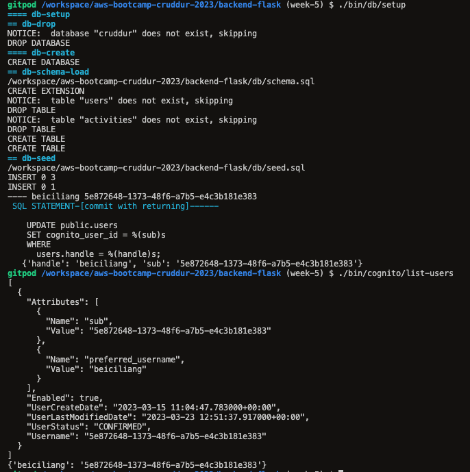
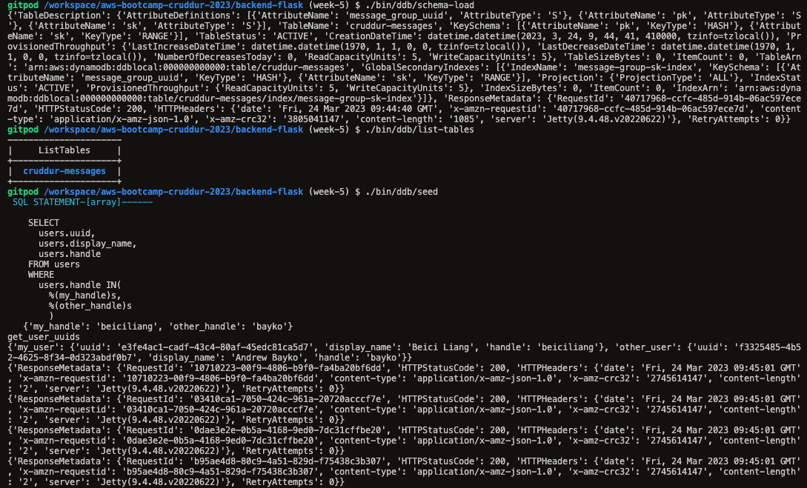
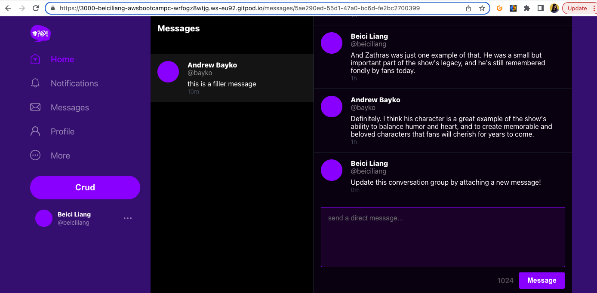
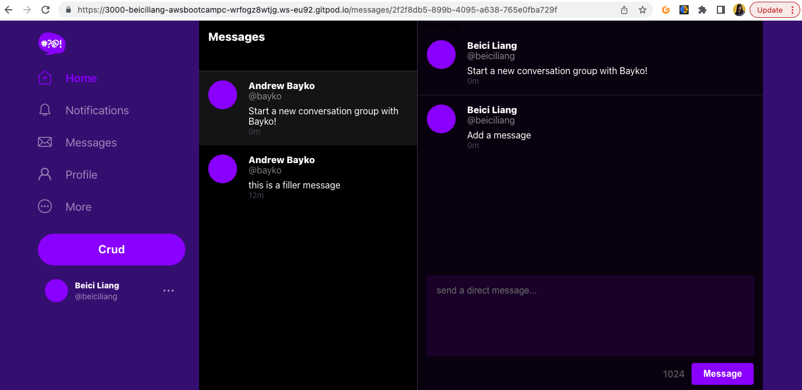
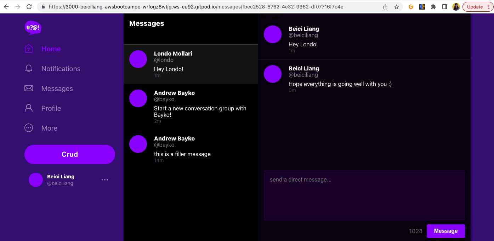
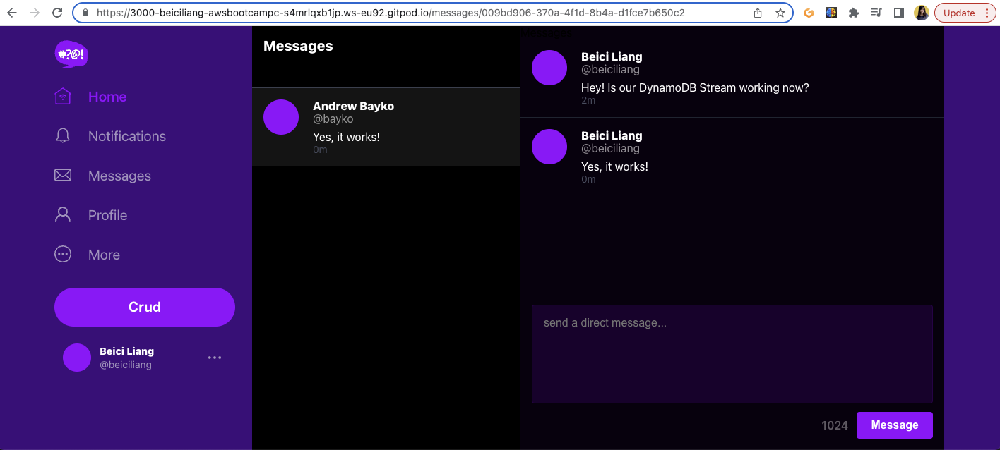
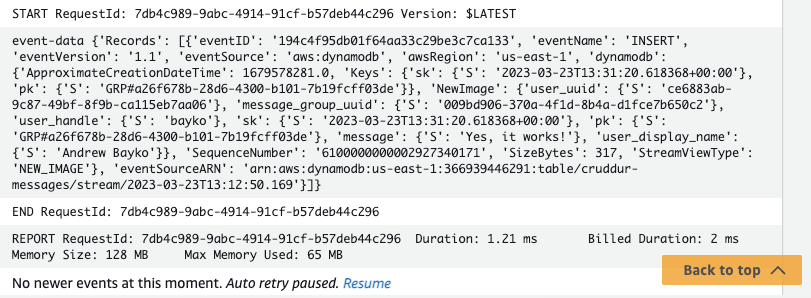

# Week 5 — DynamoDB and Serverless Caching

Based on what I've done in [week4](https://github.com/beiciliang/aws-bootcamp-cruddur-2023/blob/main/journal/week4.md), gitpod the branch of [week-4](https://github.com/beiciliang/aws-bootcamp-cruddur-2023/tree/week-4) and do the following steps (in the end, changes are committed to the branch of [week-5](https://github.com/beiciliang/aws-bootcamp-cruddur-2023/tree/week-5) and then merged to the main branch):

- [Data Modelling](#data-modelling)
- [Backend Preparation](#backend-preparation)
- [DynamoDB Utility Scripts](#dynamodb-utility-scripts)
- [Implement Conversations with DynamoDB Local](#implement-conversations-with-dynamodb-local)
- [Implement DynamoDB Stream with AWS Lambda](#implement-dynamodb-stream-with-aws-lambda)

## Data Modelling

Single Table Design is a data modelling technique in which all related data is stored in a single database table. We do it with DynamoDB for the Direct Messaging System in our Cruddur application. Here, data access can be break down into four patterns:

1. Pattern A for showing messages. Users can see a list of messages that belong to a message group.
2. Pattern B for showing message groups. Users can see a list of message groups so they can check the other persons they have been talking to.
3. Pattern C for creating a new message in a new message group.
4. Pattern D for creating a new message in an existing message group.

Accordingly, there are 3 types of items to put in our DynamoDB table.

```python
my_message_group = {
    'pk': {'S': f"GRP#{my_user_uuid}"},
    'sk': {'S': last_message_at},
    'message_group_uuid': {'S': message_group_uuid},
    'message': {'S': message},
    'user_uuid': {'S': other_user_uuid},
    'user_display_name': {'S': other_user_display_name},
    'user_handle':  {'S': other_user_handle}
}

other_message_group = {
    'pk': {'S': f"GRP#{other_user_uuid}"},
    'sk': {'S': last_message_at},
    'message_group_uuid': {'S': message_group_uuid},
    'message': {'S': message},
    'user_uuid': {'S': my_user_uuid},
    'user_display_name': {'S': my_user_display_name},
    'user_handle':  {'S': my_user_handle}
}

message = {
    'pk':   {'S': f"MSG#{message_group_uuid}"},
    'sk':   {'S': created_at},
    'message': {'S': message},
    'message_uuid': {'S': message_uuid},
    'user_uuid': {'S': my_user_uuid},
    'user_display_name': {'S': my_user_display_name},
    'user_handle': {'S': my_user_handle}
}
```

## Backend Preparation

As seen in [this commit](https://github.com/beiciliang/aws-bootcamp-cruddur-2023/commit/4bb71264bda030073b91cc11386012a5cf35becf), restructure bash scripts so that there are 3 folders storing utility commands for Postgres database (`backend-flask/bin/db`), DynamoDB (`backend-flask/bin/db`), AWS RDS (`backend-flask/bin/rds`) and AWS Cognito (`backend-flask/bin/cognito`).

Add `boto3` into `backend-flask/requirements.txt`, which is the AWS SDK for Python to create, configure, and manage AWS services such as DynamoDB.

Add command in `.gitpod.yml` as seen in [this commit](https://github.com/beiciliang/aws-bootcamp-cruddur-2023/commit/bc40904d5d4632ad3cdbbee08678a9dcbfde843c), allowing gitpod to install python libraries automatically whenever a new workspace is launched.

For the local Postgres database:

- Update seed data in `backend-flask/db/seed.sql` ([code](https://github.com/beiciliang/aws-bootcamp-cruddur-2023/blob/week-5/backend-flask/db/seed.sql)) to have 3 users and 1 activity (NOTE: set one user the same as the one you used for cruddur signin to avoid potential data conflicts).
- Create `backend-flask/bin/cognito/list-users` ([code](https://github.com/beiciliang/aws-bootcamp-cruddur-2023/blob/week-5/backend-flask/bin/cognito/list-users)) to list users data saved in AWS Cognito.
- Create `backend-flask/bin/db/update_cognito_user_ids` ([code](https://github.com/beiciliang/aws-bootcamp-cruddur-2023/blob/week-5/backend-flask/bin/db/update_cognito_user_ids)) to update users in the seed data with actual Cognito IDs if exist.
- Set `CONNECTION_URL: "postgresql://postgres:password@db:5432/cruddur"` in `docker-compose.yml`, because this week we are working with the users data queried from the local Postgres database named `cruddur`.

Add `python "$bin_path/db/update_cognito_user_ids"` to run `backend-flask/bin/db/update_cognito_user_ids` ([code](https://github.com/beiciliang/aws-bootcamp-cruddur-2023/blob/week-5/backend-flask/bin/db/update_cognito_user_ids)) in the end of `backend-flask/bin/db/setup` ([code](https://github.com/beiciliang/aws-bootcamp-cruddur-2023/blob/week-5/backend-flask/bin/db/setup)). If we compose up the docker and run the setup script, it will create a local Postgres database named `cruddur` with 2 tables. In the `users` table, 1 user with handle `beiciliang` will be updated with actual AWS Cognito ID, which matches the value if we check with `./bin/cognito/list-users` as shown in the screenshot below.



We can also update a dummy cognito ID manually for another user `bayko` by the following commands:

```sh
./bin/db/connect
UPDATE public.users SET cognito_user_id = 'f73f4b05-a59e-468b-8a29-a1c39e7a2222' WHERE users.handle = 'bayko';
\q
```

## DynamoDB Utility Scripts

In the directory `backend-flask/bin/ddb/`, create the following utility scripts to easily setup, teardown, and debug DynamoDB data.

- `schema-load` ([code](https://github.com/beiciliang/aws-bootcamp-cruddur-2023/blob/week-5/backend-flask/bin/ddb/schema-load)): create a table named `cruddur-messages` either for DynamoDB local or on the AWS
- `list-tables` ([code](https://github.com/beiciliang/aws-bootcamp-cruddur-2023/blob/week-5/backend-flask/bin/ddb/list-tables)): list the name of tables we created
- `drop` ([code](https://github.com/beiciliang/aws-bootcamp-cruddur-2023/blob/week-5/backend-flask/bin/ddb/drop)): drop a table by its name, e.g. `drop cruddur-messages`
- `seed` ([code](https://github.com/beiciliang/aws-bootcamp-cruddur-2023/blob/week-5/backend-flask/bin/ddb/seed)): load the seed data into the table `cruddur-messages` with hard-coded `message_group_uuid` (**NOTE**: to avoid potential data conflict, I replaced `my_handle` from `andrewbrown` to `beiciliang`; Plus, `created_at` should be set back a couple of hours so that seed messages are not created for the future time, how to correctly implement timezones for ISO 8601 can be seen in [this commit](https://github.com/beiciliang/aws-bootcamp-cruddur-2023/commit/0fb28cd55e11fb3a886c4e0bc08ae4f979967486); More references on datetime issues can be seen [here](https://github.com/omenking/aws-bootcamp-cruddur-2023/blob/week-5-timezones/journal/week5.md))
- `scan` ([code](https://github.com/beiciliang/aws-bootcamp-cruddur-2023/blob/week-5/backend-flask/bin/ddb/scan)): scan all the items saved in the table `cruddur-messages`
- `patterns/get-conversation` ([code](https://github.com/beiciliang/aws-bootcamp-cruddur-2023/blob/week-5/backend-flask/bin/ddb/patterns/get-conversation)): list messages associated with the hard-coded `message_group_uuid` and print the consumed capacity
- `patterns/list-conversations` ([code](https://github.com/beiciliang/aws-bootcamp-cruddur-2023/blob/week-5/backend-flask/bin/ddb/patterns/list-conversations)): list message groups and print the consumed capacity (NOTE: this script uses functions from `backend-flask/lib/db.py`, which needs to be updated as seen in [this commit](https://github.com/beiciliang/aws-bootcamp-cruddur-2023/commit/d9405cfc2ee5217fbec5798ee07115eab4368229#diff-4d4413b1b6b19e2bba84add763693470bf0abf242e3395c156c7b2a3a63b5ba1) and [this commit](https://github.com/beiciliang/aws-bootcamp-cruddur-2023/commit/294af409aae98f50c32f48ebc244d21c826434f6#diff-4d4413b1b6b19e2bba84add763693470bf0abf242e3395c156c7b2a3a63b5ba1))

Then we can run `./bin/ddb/schema-load` and then `./bin/ddb/seed` to actually load the seed data into our local DynamoDB. The terminal will print out info as seen in the screenshot below.



Following are the proof of running other scripts.

`./bin/ddb/scan` returns:

```sh
{'user_uuid': 'f3325485-4b52-4625-8f34-0d323abdf0b7', 'message_group_uuid': '5ae290ed-55d1-47a0-bc6d-fe2bc2700399', 'user_handle': 'bayko', 'sk': '2023-03-24T09:45:01.561513+00:00', 'pk': 'GRP#e3fe4ac1-cadf-43c4-80af-45edc81ca5d7', 'message': 'this is a filler message', 'user_display_name': 'Andrew Bayko'}
...
{'user_uuid': 'e3fe4ac1-cadf-43c4-80af-45edc81ca5d7', 'user_handle': 'beiciliang', 'sk': '2023-03-24T06:45:01.561513+00:00', 'pk': 'MSG#5ae290ed-55d1-47a0-bc6d-fe2bc2700399', 'message_uuid': '481723ea-6f5e-4f48-a177-1da5f3f8417d', 'message': "Have you ever watched Babylon 5? It's one of my favorite TV shows!", 'user_display_name': 'Beici Liang'}
{'user_uuid': 'f3325485-4b52-4625-8f34-0d323abdf0b7', 'user_handle': 'bayko', 'sk': '2023-03-24T06:46:01.561513+00:00', 'pk': 'MSG#5ae290ed-55d1-47a0-bc6d-fe2bc2700399', 'message_uuid': '4064301e-0762-405e-aa78-6b2d6ee7110e', 'message': "Yes, I have! I love it too. What's your favorite season?", 'user_display_name': 'Andrew Bayko'}
{'user_uuid': 'e3fe4ac1-cadf-43c4-80af-45edc81ca5d7', 'user_handle': 'beiciliang', 'sk': '2023-03-24T06:47:01.561513+00:00', 'pk': 'MSG#5ae290ed-55d1-47a0-bc6d-fe2bc2700399', 'message_uuid': 'ff010a6b-e073-4660-aaa8-c45f97f58e79', 'message': 'I think my favorite season has to be season 3. So many great episodes, like "Severed Dreams" and "War Without End."', 'user_display_name': 'Beici Liang'}
{'user_uuid': 'f3325485-4b52-4625-8f34-0d323abdf0b7', 'user_handle': 'bayko', 'sk': '2023-03-24T06:48:01.561513+00:00', 'pk': 'MSG#5ae290ed-55d1-47a0-bc6d-fe2bc2700399', 'message_uuid': '9d150549-63fb-4e61-a7e2-72c85beb454e', 'message': 'Yeah, season 3 was amazing! I also loved season 4, especially with the Shadow War heating up and the introduction of the White Star.', 'user_display_name': 'Andrew Bayko'}
...
{'user_uuid': 'e3fe4ac1-cadf-43c4-80af-45edc81ca5d7', 'message_group_uuid': '5ae290ed-55d1-47a0-bc6d-fe2bc2700399', 'user_handle': 'beiciliang', 'sk': '2023-03-24T09:45:01.561513+00:00', 'pk': 'GRP#f3325485-4b52-4625-8f34-0d323abdf0b7', 'message': 'this is a filler message', 'user_display_name': 'Beici Liang'}
```

`./bin/ddb/patterns/get-conversation` returns:

```sh
{
  "ConsumedCapacity": {
    "CapacityUnits": 1.0,
    "TableName": "cruddur-messages"
  },
  "Count": 20,
  "Items": [
    {
      ...
      "message": {
        "S": "I thought the special effects in Babylon 5 were really impressive, especially for a show that aired in the 90s. The use of CGI to create the spaceships and other sci-fi elements was really innovative for its time."
      },
      "message_uuid": {
        "S": "2ab91e7b-0531-41c4-bd5c-1ee7321ba741"
      },
      "pk": {
        "S": "MSG#5ae290ed-55d1-47a0-bc6d-fe2bc2700399"
      },
      "sk": {
        "S": "2023-03-24T08:10:01.561513+00:00"
      },
      "user_display_name": {
        "S": "Andrew Bayko"
      },
      "user_handle": {
        "S": "bayko"
      },
      "user_uuid": {
        "S": "f3325485-4b52-4625-8f34-0d323abdf0b7"
      }
    },
    {
      "message": {
        "S": "One thing that really stands out about Babylon 5 is the quality of the special effects. What did you think about the show's use of CGI and other visual effects?"
      },
      "message_uuid": {
        "S": "68b3d3be-3807-48b1-ae39-7150db0a5602"
      },
      "pk": {
        "S": "MSG#5ae290ed-55d1-47a0-bc6d-fe2bc2700399"
      },
      "sk": {
        "S": "2023-03-24T08:09:01.561513+00:00"
      },
      "user_display_name": {
        "S": "Beici Liang"
      },
      "user_handle": {
        "S": "beiciliang"
      },
      "user_uuid": {
        "S": "e3fe4ac1-cadf-43c4-80af-45edc81ca5d7"
      }
    }
  ],
  "LastEvaluatedKey": {
    "pk": {
      "S": "MSG#5ae290ed-55d1-47a0-bc6d-fe2bc2700399"
    },
    "sk": {
      "S": "2023-03-24T08:09:01.561513+00:00"
    }
  },
  "ResponseMetadata": {
    "HTTPHeaders": {
      "content-type": "application/x-amz-json-1.0",
      "date": "Fri, 24 Mar 2023 09:51:14 GMT",
      "server": "Jetty(9.4.48.v20220622)",
      "transfer-encoding": "chunked",
      "x-amz-crc32": "3652665931",
      "x-amzn-requestid": "0d2b0b20-fc1f-42c9-b9e5-e272ee01f86d"
    },
    "HTTPStatusCode": 200,
    "RequestId": "0d2b0b20-fc1f-42c9-b9e5-e272ee01f86d",
    "RetryAttempts": 0
  },
  "ScannedCount": 20
}
{
  "CapacityUnits": 1.0,
  "TableName": "cruddur-messages"
}
beiciliang  2023-03-24 08:09 AM   One thing that really stands out about B...
bayko       2023-03-24 08:10 AM   I thought the special effects in Babylon...
beiciliang  2023-03-24 08:11 AM   Yes, I was really blown away by the leve...
bayko       2023-03-24 08:12 AM   And I also appreciated the way the show ...
beiciliang  2023-03-24 08:13 AM   Absolutely. The show had a great balance...
bayko       2023-03-24 08:14 AM   And it's also worth noting the way the s...
beiciliang  2023-03-24 08:15 AM   Yes, I agree. And it's impressive how th...
bayko       2023-03-24 08:16 AM   Definitely. And it's one of the reasons ...
beiciliang  2023-03-24 08:17 AM   Agreed. And it's also worth noting the w...
bayko       2023-03-24 08:18 AM   Yes, it definitely had a big impact on t...
beiciliang  2023-03-24 08:19 AM   Another character I wanted to discuss is...
bayko       2023-03-24 08:20 AM   Zathras was a really unique and memorabl...
beiciliang  2023-03-24 08:21 AM   Yes, I thought he was a great addition t...
bayko       2023-03-24 08:22 AM   And I appreciated the way the show used ...
beiciliang  2023-03-24 08:23 AM   Definitely. It was a great way to integr...
bayko       2023-03-24 08:24 AM   Yeah, that was a clever storytelling dev...
beiciliang  2023-03-24 08:25 AM   I also thought that Zathras was a great ...
bayko       2023-03-24 08:26 AM   Yes, that's a good point. Babylon 5 was ...
beiciliang  2023-03-24 08:27 AM   And Zathras was just one example of that...
bayko       2023-03-24 08:28 AM   Definitely. I think his character is a g...
```

`./bin/ddb/patterns/list-conversations` returns:

```sh
  SQL STATEMENT-[value]------

    SELECT
      users.uuid
    FROM users
    WHERE
      users.handle =%(handle)s
   {'handle': 'beiciliang'}

my-uuid: e3fe4ac1-cadf-43c4-80af-45edc81ca5d7

{
  "ConsumedCapacity": {
    "CapacityUnits": 0.5,
    "TableName": "cruddur-messages"
  },
  "Count": 1,
  "Items": [
    {
      "message": {
        "S": "this is a filler message"
      },
      "message_group_uuid": {
        "S": "5ae290ed-55d1-47a0-bc6d-fe2bc2700399"
      },
      "pk": {
        "S": "GRP#e3fe4ac1-cadf-43c4-80af-45edc81ca5d7"
      },
      "sk": {
        "S": "2023-03-24T09:45:01.561513+00:00"
      },
      "user_display_name": {
        "S": "Andrew Bayko"
      },
      "user_handle": {
        "S": "bayko"
      },
      "user_uuid": {
        "S": "f3325485-4b52-4625-8f34-0d323abdf0b7"
      }
    }
  ],
  "ResponseMetadata": {
    "HTTPHeaders": {
      "content-length": "447",
      "content-type": "application/x-amz-json-1.0",
      "date": "Fri, 24 Mar 2023 09:52:38 GMT",
      "server": "Jetty(9.4.48.v20220622)",
      "x-amz-crc32": "395179250",
      "x-amzn-requestid": "eba57367-3785-42d4-9036-6d5cf360e58e"
    },
    "HTTPStatusCode": 200,
    "RequestId": "eba57367-3785-42d4-9036-6d5cf360e58e",
    "RetryAttempts": 0
  },
  "ScannedCount": 1
}
```

## Implement Conversations with DynamoDB Local

Firstly, create `backend-flask/lib/ddb.py` ([code](https://github.com/beiciliang/aws-bootcamp-cruddur-2023/blob/week-5/backend-flask/lib/ddb.py)) which creates `class Ddb` to reuse its functions in other scripts. Since this section is to work with local Dynamodb, set `AWS_ENDPOINT_URL: "http://dynamodb-local:8000"` in `docker-compose.yml`.

Other main changes can be seen in [this commit](https://github.com/beiciliang/aws-bootcamp-cruddur-2023/commit/294af409aae98f50c32f48ebc244d21c826434f6) and [this commit](https://github.com/beiciliang/aws-bootcamp-cruddur-2023/commit/d02d5b164bbd4386d07c9623788862f6c66d2fc8), which mainly run the following implementations.

Update/create routes and functions in the backend to get messages and message groups from Dynamodb instead of hard-coded data; Instead of passing in `handle`, pass `message_group_uuid`; These implementations mainly use `list_message_groups` and `list_messages` of the `Ddb` class:

- `backend-flask/app.py` (mainly, instead of using `"/api/messages/@<string:handle>"`, use `"/api/messages/<string:message_group_uuid>"`)
- `backend-flask/services/message_groups.py`
- `backend-flask/services/messages.py`
- Create `backend-flask/db/sql/users/uuid_from_cognito_user_id.sql`
- Change `backend_url` from using `${handle}` to `${params.message_group_uuid}` in `frontend-react-js/src/pages/MessageGroupPage.js`
- Change path from `"/messages/@:handle"` to `"/messages/:message_group_uuid"` in `frontend-react-js/src/App.js`
- Change `params.handle` to `params.message_group_uuid` and `props.message_group.handle` to `props.message_group.uuid` in `frontend-react-js/src/components/MessageGroupItem.js`

Update authentication in the frontend:

- Create `frontend-react-js/src/lib/CheckAuth.js` which can be reused in other scripts for authentication
- `frontend-react-js/src/pages/HomeFeedPage.js`
- `frontend-react-js/src/pages/MessageGroupPage.js`
- `frontend-react-js/src/pages/MessageGroupsPage.js`
- `frontend-react-js/src/components/MessageForm.js`

Implementation of creating a new message, which mainly uses `create_message` of the `Ddb` class:

- Update the content for `body` in `frontend-react-js/src/components/MessageForm.js`
- Update function `data_create_message` in `backend-flask/app.py`
- Update `backend-flask/services/create_message.py` which has two modes - "update" the new message to an existing message group, or "create" the new message with a new message group
- Create `backend-flask/db/sql/users/create_message_users.sql`

Implementation for extra pages, which mainly uses `create_message_group` of the `Ddb` class:

- Import `MessageGroupNewPage` from `./pages/MessageGroupNewPage` and add the corresponding router in `frontend-react-js/src/App.js`
- Create `frontend-react-js/src/pages/MessageGroupNewPage.js`
- Create `frontend-react-js/src/components/MessageGroupNewItem.js`
- Add the endpoint and function for user short in `backend-flask/app.py`
- Create `backend-flask/services/users_short.py`
- Create `backend-flask/db/sql/users/short.sql`
- Update `frontend-react-js/src/components/MessageGroupFeed.js`
- Update `frontend-react-js/src/components/MessageForm.js`

After completing the above steps, compose up and go to the frontend, sign in and visit the messages tab, it shows the seed data. If I send a direct message to Bayko, the message will be presented in the bottom of the current message group:



We can visit url `https://<frontend_address>/messages/new/<handle>` to create and update new messages in a new message group with Bayko (set the url handle to `bayko`), or start a conversation with Londo (set the url handle to `londo`) as seen in the screenshots below.





## Implement DynamoDB Stream with AWS Lambda

As seen in [this commit](https://github.com/beiciliang/aws-bootcamp-cruddur-2023/commit/b3c241160494e0e5463ad908a245379d89252236), we can work with the DynamoDB on the AWS, and add a trigger to execute a Lambda function which can deal with DynamoDB stream events:

- Comment `AWS_ENDPOINT_URL` in `docker-compose.yml`, then compose up and run `./bin/db/setup`
- Update `./bin/ddb/schema-load` with a Global Secondary Index (GSI) and run `./bin/ddb/schema-load prod`, leading to a DynamoDB table named `cruddur-messages` created on our AWS
- On AWS in DynamoDB > Tables > cruddur-messages > Turn on DynamoDB stream, choose "new image"
- On AWS in the VPC console, create an endpoint named `cruddur-ddb`, choose services with DynamoDB, and select the default VPC and route table
- On AWS in the Lambda console, create a new function named `cruddur-messaging-stream` and enable VPC in its advanced settings; deploy the code as seen in `aws/lambdas/cruddur-messaging-stream.py`; add permission of `AWSLambdaInvocation-DynamoDB` to the Lambda IAM role; more permissions can be added by creating inline policies as seen in `aws/policies/cruddur-message-stream-policy.json`
- On AWS in the DynamoDB console, create a new trigger and select `cruddur-messaging-stream`

Now if we compose up, visit the frontend and sign in, it's empty under the messages tab, because there is no data in our AWS DynamoDB. To create a new message in a new message group with Bayko, visit `https://<frontend_address>/messages/new/bayko`, messages can be created and updated as seen in the screenshot below.



If everything works, there is no error observed on AWS in CloudWatch > Log groups > /aws/lambda/cruddur-messaging-stream as shown in the screenshots below.


