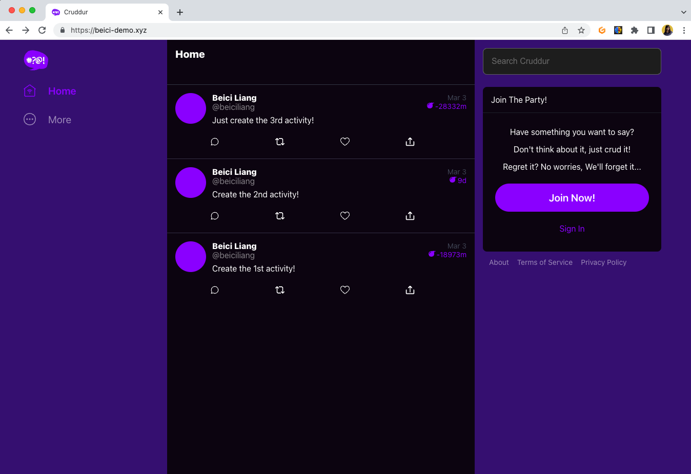

# Week 7 — Solving CORS with a Load Balancer and Custom Domain

Week 7 was delivered together with Week 6. Check my [week6 journal](https://github.com/beiciliang/aws-bootcamp-cruddur-2023/blob/main/journal/week6.md) for details. Here I only attach screenshots as the proofs for my working application.

1. Created services for `backend-flask` and `frontend-react-js` under the `cruddur` cluster on ECS.

2. Registered corresponding tasks running healthy.

3. We can further check the configuration for the frontend task, running healthy containers.

4. We can further check the configuration for the backend task, running healthy containers.

5. On CloudWatch, log events show no problems with the health check.

6. If I go to the api domain, health check returns a success, and RDS data of activities can be retrieved.

7. Start page of our domain presents as the following screenshot.

8. After signing in, I can crud a new post.

9. I can send messages to a mock user previously inserted into the RDS.

