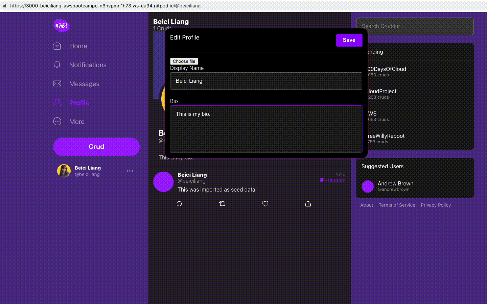

# Week 8 — Serverless Image Processing

Based on what I've done in previous weeks with tag [week0607](https://github.com/beiciliang/aws-bootcamp-cruddur-2023/tree/week0607), from which open a new gitpod workspace and do the following steps (in the end, changes are committed to the branch of [week-8](https://github.com/beiciliang/aws-bootcamp-cruddur-2023/tree/week-8) and then merged to the main branch):

- [Preparation](#preparation)
- [Implement CDK Stack](#implement-cdk-stack)
- [Serving Avatars via CloudFront](#serving-avatars-via-cloudfront)
- [Backend and Frontend for Profile Page](#backend-and-frontend-for-profile-page)
- [DB Migration](#db-migration)
- [Implement Avatar Uploading](#implement-avatar-uploading)
- [Double Check Environment Variables](#double-check-environment-variables)
- [Proof of Implementation](#proof-of-implementation)

## Preparation

This week we need to use CDK (Cloud Development Kit) to create S3 buckets, Lambda functions, SNS topics, etc., allowing users to upload their avatars to update their profiles.

There are some commands to run every time before and after docker compose up. To be done more efficiently, create the following scripts as seen in `./bin/bootstrap` ([code](https://github.com/beiciliang/aws-bootcamp-cruddur-2023/blob/week-8/bin/bootstrap)) and `./bin/prepare` ([code](https://github.com/beiciliang/aws-bootcamp-cruddur-2023/blob/week-8/bin/prepare)):

```sh
cd /workspace/aws-bootcamp-cruddur-2023/bin
touch bootstrap prepare
chmod u+x bootstrap prepare
```

## Implement CDK Stack

Firstly, manually create a S3 bucket named `assets.<domain_name>` (e.g., `assets.beici-demo.xyz`), which will be used for serving the processed images in the profile page. In this bucket, create a folder named `banners`, and then upload a `banner.jpg` into the folder.

Secondly, export following env vars according to your domain name and another S3 bucket (e.g., `beici-cruddur-uploaded-avatars`), which will be created by CDK later for saving the original uploaded avatar images:

```sh
export DOMAIN_NAME=beici-demo.xyz
gp env DOMAIN_NAME=beici-demo.xyz
export UPLOADS_BUCKET_NAME=beici-cruddur-uploaded-avatars
gp env UPLOADS_BUCKET_NAME=beici-cruddur-uploaded-avatars
```

In order to process uploaded images into a specific dimension, a Lambda function will be created by CDK. This function and related packages are specified in the scripts ([repo](https://github.com/beiciliang/aws-bootcamp-cruddur-2023/tree/week-8/aws/lambdas/process-images)) created by the following commands:

```sh
mkdir -p aws/lambdas/process-images
cd aws/lambdas/process-images
touch index.js s3-image-processing.js test.js  example.json
npm init -y
npm install sharp @aws-sdk/client-s3
```

To check if the created Lambda function works or not, create scripts ([repo](https://github.com/beiciliang/aws-bootcamp-cruddur-2023/tree/week-8/bin/avatar)) by the following commands and then upload a profile picture named `data.jpg` inside the created folder `files`:

```sh
cd /workspace/aws-bootcamp-cruddur-2023
mkdir -p bin/avatar
cd bin/avatar
touch build upload clear
chmod u+x build upload clear
mkdir files
```

Now we can initialize CDK and install related packages:

```sh
cd /workspace/aws-bootcamp-cruddur-2023
mkdir thumbing-serverless-cdk
cd thumbing-serverless-cdk
touch .env.example
npm install aws-cdk -g
cdk init app --language typescript
npm install dotenv
```

Update `.env.example` ([reference code](https://github.com/beiciliang/aws-bootcamp-cruddur-2023/blob/week-8/thumbing-serverless-cdk/.env.example)), and run `cp .env.example .env`. Update `./bin/thumbing-serverless-cdk.ts` and `./lib/thumbing-serverless-cdk-stack.ts` ([repo](https://github.com/beiciliang/aws-bootcamp-cruddur-2023/tree/week-8/thumbing-serverless-cdk)).

In order to let the `sharp` dependency work in Lambda, run the script:

```sh
cd /workspace/aws-bootcamp-cruddur-2023
./bin/avatar/build

cd thumbing-serverless-cdk
```

To create AWS CloudFormation stack `ThumbingServerlessCdkStack`:

- run `cdk synth` you can debug and observe the generated `cdk.out`
- run `cdk bootstrap "aws://${AWS_ACCOUNT_ID}/${AWS_DEFAULT_REGION}"` (just once)
- finally run `cdk deploy`, you can observe your what have been created on AWS CloudFormation

Now, after running `./bin/avatar/upload`, at AWS I can observe that the `data.jpg` can be uploaded into the `beici-cruddur-uploaded-avatars` S3 bucket, which triggers `ThumbLambda` function to process the image, and then saves the processed image into the `avatars` folder in the `assets.beici-demo.xyz` S3 bucket.

## Serving Avatars via CloudFront

Amazon CloudFront is designed to work seamlessly with S3 to serve your S3 content in a faster way. Also, using CloudFront to serve s3 content gives you a lot more flexibility and control. To create a CloudFront distribution, a certificate in the `us-east-1` zone for `*.<your_domain_name>` is required. If you don't have one yet, create one via AWS Certificate Manager, and click "Create records in Route 53" after the certificate is issued.

Create a distribution by:

- set the Origin domain to point to `assets.<your_domain_name>`
- choose Origin access control settings (recommended) and create a control setting
- select Redirect HTTP to HTTPS for the viewer protocol policy
- choose CachingOptimized, CORS-CustomOrigin as the optional Origin request policy, and SimpleCORS as the response headers policy
- set Alternate domain name (CNAME) as `assets.<your_domain_name>`
- choose the previously created ACM for the Custom SSL certificate.

Remember to copy the created policy to the `assets.<your_domain_name>` bucket by editing its bucket policy.

In order to visit `https://assets.<your_domain_name>/avatars/data.jpg` to see the processed image, we need to create a record via Route 53:

- set record name as `assets.<your_domain_name>`
- turn on alias, route traffic to alias to CloudFront distribution
- in my case, you can see my profile at https://assets.beici-demo.xyz/avatars/data.jpg

Since we don't use versioned file names for a user's avatar, CloudFront edge caches old avatar. Until the old one expires, you will not immediately see the new avatar after updating the profile. Therefore, we need to [invalidate files](https://docs.aws.amazon.com/AmazonCloudFront/latest/DeveloperGuide/Invalidation.html) by creating an invalidation:

- go to the distribution we created
- under the Invalidations tab, click create
- add object path `/avatars/*`

This ensures that CloudFront will always serve the latest avatar uploaded by the user.

## Backend and Frontend for Profile Page

For the backend, update/create the following scripts ([repo](https://github.com/beiciliang/aws-bootcamp-cruddur-2023/tree/week-8/backend-flask)):

- `backend-flask/db/sql/users/show.sql` to get info about user
- `backend-flask/db/sql/users/update.sql` to update bio
- `backend-flask/services/user_activities.py`
- `backend-flask/services/update_profile.py`
- `backend-flask/app.py`

For the frontend, update/create the following scripts ([repo](https://github.com/beiciliang/aws-bootcamp-cruddur-2023/tree/week-8/frontend-react-js)):

- `frontend-react-js/src/components/ActivityFeed.js`
- `frontend-react-js/src/components/CrudButton.js`
- `frontend-react-js/src/components/DesktopNavigation.js` to change the hardcoded url into yours
- `frontend-react-js/src/components/EditProfileButton.css`
- `frontend-react-js/src/components/EditProfileButton.js`
- `frontend-react-js/src/components/Popup.css`
- `frontend-react-js/src/components/ProfileAvatar.css`
- `frontend-react-js/src/components/ProfileAvatar.js`
- `frontend-react-js/src/components/ProfileForm.css`
- `frontend-react-js/src/components/ProfileForm.js` to let user edit their profile page
- `frontend-react-js/src/components/ProfileHeading.css`
- `frontend-react-js/src/components/ProfileHeading.js` to display profile details
- `frontend-react-js/src/components/ProfileInfo.js`
- `frontend-react-js/src/components/ReplyForm.css`
- `frontend-react-js/src/pages/HomeFeedPage.js`
- `frontend-react-js/src/pages/NotificationsFeedPage.js`
- `frontend-react-js/src/pages/UserFeedPage.js` to fetch data
- `frontend-react-js/src/lib/CheckAuth.js`
- `frontend-react-js/src/App.js`
- `frontend-react-js/jsconfig.json`

## DB Migration

Since our previous postgres database didn't have the column for saving bio, migration is required. We also need to update some backend scripts in order to let users edit bio and save the updated bio in the database.

Create an empty `backend-flask/db/migrations/.keep`, and an executable script `bin/generate/migration` as seen in [code](https://github.com/beiciliang/aws-bootcamp-cruddur-2023/blob/week-8/bin/generate/migration). Run `./bin/generate/migration add_bio_column`, a python script such as `backend-flask/db/migrations/1681742424_add_bio_column.py` will be generated. Edit the generated python script with SQL commands as seen in [code](https://github.com/beiciliang/aws-bootcamp-cruddur-2023/blob/week-8/backend-flask/db/migrations/1681742424_add_bio_column.py).

Update `backend-flask/db/schema.sql`, and update `backend-flask/lib/db.py` with verbose option.

Create executable scripts `bin/db/migrate` and `bin/db/rollback` as seen in [repo](https://github.com/beiciliang/aws-bootcamp-cruddur-2023/tree/week-8/bin/db). If we run `./bin/db/migrate`, a new column called bio will be created in the db table of `users`.

## Implement Avatar Uploading

Firstly we need to create an API endpoint, which invoke a presigned URL like `https://<API_ID>.execute-api.<AWS_REGION>.amazonaws.com`. This presigned URL can give access to the S3 bucket (`beici-cruddur-uploaded-avatars` in my case), and can deliver the uploaded image to the bucket.

We will call `https://<API_ID>.execute-api.<AWS_REGION>.amazonaws.com/avatars/key_upload` to do the upload, where the `/avatars/key_upload` resource is manipulated by the `POST` method. We will also create a Lambda function named `CruddurAvatarUpload` to decode the URL and the request. In addition, we need to implement authorization with another Lambda function named `CruddurApiGatewayLambdaAuthorizer`, which is important to control the data that is allowed to be transmitted from our gitpod workspace using the APIs.

To successfully implement above setups:

- in `aws/lambdas/cruddur-upload-avatar/`, create a basic `function.rb` and run `bundle init`; edit the generated `Gemfile`, then run `bundle install` and `bundle exec ruby function.rb`; a presigned url can be generated for local testing. The actual `function.rb` used in `CruddurAvatarUpload` is shown as in [this code](https://github.com/beiciliang/aws-bootcamp-cruddur-2023/blob/week-8/aws/lambdas/cruddur-upload-avatar/function.rb).
- in `aws/lambdas/lambda-authorizer/`, create `index.js`, run `npm install aws-jwt-verify --save`, and download everything in this folder into a zip file (you can zip by command `zip -r lambda_authorizer.zip .`), which will be uploaded into `CruddurApiGatewayLambdaAuthorizer`.

At AWS Lambda, create the corresponding two functions:

1. `CruddurAvatarUpload`

   - code source as seen in `aws/lambdas/cruddur-upload-avatar/function.rb` with your own gitpod frontend URL as `Access-Control-Allow-Origin`
   - rename Handler as function.handler
   - add environment variable `UPLOADS_BUCKET_NAME`
   - create a new policy `PresignedUrlAvatarPolicy` as seen in `aws/policies/s3-upload-avatar-presigned-url-policy.json` ([code](https://github.com/beiciliang/aws-bootcamp-cruddur-2023/blob/week-8/aws/policies/s3-upload-avatar-presigned-url-policy.json)), and then attach this policy to the role of this Lambda

2. `CruddurApiGatewayLambdaAuthorizer`

   - upload `lambda_authorizer.zip` into the code source
   - add environment variables `USER_POOL_ID` and `CLIENT_ID`

Different from Andrew's video and his codes, I don't have a layer of JWT cause I passed the JWT sub from `CruddurApiGatewayLambdaAuthorizer` to `CruddurAvatarUpload` ([reference](https://docs.aws.amazon.com/apigateway/latest/developerguide/http-api-lambda-authorizer.html)).

At AWS S3, update the permissions of `beici-cruddur-uploaded-avatars` by editing the CORS configuration as seen in `aws/s3/cors.json` ([code](https://github.com/beiciliang/aws-bootcamp-cruddur-2023/blob/week-8/aws/s3/cors.json)).

At AWS API Gateway, create `api.<domain_name>` (in my case `api.beici-demo.xyz`), create two routes:

- `POST /avatars/key_upload` with authorizer `CruddurJWTAuthorizer` which invoke Lambda `CruddurApiGatewayLambdaAuthorizer`, and with integration `CruddurAvatarUpload`
- `OPTIONS /{proxy+}` without authorizer, but with integration `CruddurAvatarUpload`

Noted that we don't need to configure CORS at API Gateway. If you did before, click "Clear" to avoid potential CORS issues.

## Double Check Environment Variables

There are some environment variables and setups worth double checking:

- `function.rb` in `CruddurAvatarUpload`: set `Access-Control-Allow-Origin` as your own frontend URL.
- `index.js` in `CruddurApiGatewayLambdaAuthorizer`: make sure that token can be correctly extracted from the authorization header.
- Environment variables in the above two Lambdas were added.
- `erb/frontend-react-js.env.erb`: `REACT_APP_API_GATEWAY_ENDPOINT_URL` equals to the Invoke URL shown in the API Gateway.
- `frontend-react-js/src/components/ProfileForm.js`: `gateway_url` and `backend_url` are correctly set.
- Pay attention to variable name inconsistency in some scripts, e.g., `cognito_user_uuid` vs. `cognito_user_id`.

## Proof of Implementation

In my gitpod space, run the following commands, and then edit my profile with a new bio and image. The GIF below proofs that avatar uploading and rendering were successfully implemented.

```sh
cd /workspace/aws-bootcamp-cruddur-2023
./bin/bootstrap
docker compose up
./bin/prepare
```


